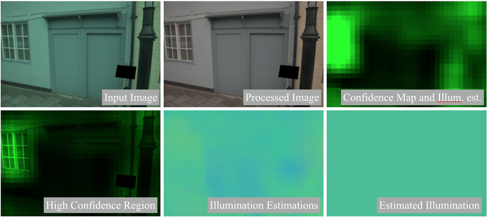

# FC<sup>4</sup>:<br> Fully Convolutional Color Constancy with Confidence-weighted Pooling (CVPR 2017)
#### [[Paper](http://openaccess.thecvf.com/content_cvpr_2017/papers/Hu_FC4_Fully_Convolutional_CVPR_2017_paper.pdf)]
[Yuanming Hu](http://taichi.graphics/me/)<sup>1,2</sup>, [Baoyuan Wang](https://sites.google.com/site/zjuwby/)<sup>1</sup>, [Stephen Lin](https://www.microsoft.com/en-us/research/people/stevelin/)<sup>1</sup>

<sup>1</sup>Microsoft Research <sup>2</sup>Tsinghua University (now MIT CSAIL)
```
    代码源自https://github.com/yuanming-hu/fc4
    原作者代码适用于python2的环境，笔者通过一系列改动使代码能够适应python3的环境。
    以下所有内容都基于https://github.com/yuanming-hu/fc4
 ```

**Change log:**
- July 19, 2018:
   - Improved instructions for (painless) reproducibility.
   - See updated FAQ **How to reproduce the numbers reported in the paper?**
- May 22, 2018:
   - Added some FAQs.
- April 25, 2018: **Released network definition scripts and training instructions**. TODO:
   - Update `config.py` for more datasets and benchmarks.
   - Upgrade `python` version. **Please use python 2.7 for now.**
- April 15, 2018: Started preparing for code release. 
a) **Installation**
 
 Please use python3 

b) **Data Pre-processing**

[*Shi's Re-processing of Gehler's Raw Dataset*:](http://www.cs.sfu.ca/~colour/data/shi_gehler/)
 - Download the 4 zip files from the website
 - Extract the `png` images into `fc4/data/gehler/images/`, without creating subfolders.
 - `python datasets.py`, and wait for it to finish
 - `python show_patches.py` to view **data-augmented** patches. Press any key to see the next patch. You can use this data provider to train your own network.
    这一步笔者始终不清楚原作者的目的，而且觉得这一步可以不执行。
c) **Model Training**
 - First, make sure you have preprocessed the data.
 - `python fc4.py train example`, and wait for it to finish. The model will be located at `models/fc4/example/`. `example` here is the model name and you can change it to any other suitable identifier.
 - Note that there are three folds and you need to modify Ln 99 of `config.py` to `FOLD = 1` or `FOLD = 2` for other two folds.
   可以执行这一步代码，也可以使用已经训练过的模型
d) **Visualize Confidence Maps**
 You can look at how the confidence map evolves at the folders `models/fc4/example/testXXXXsummaries_0.500000`.

e) **Pretrained models?**

  To get the pretrained models on the ColorChecker dataset, please download [**Pretrained models on the ColorChecker Dataset**](https://github.com/yuanming-hu/fc4/releases/download/pretrained/pretrained_colorchecker.zip), and put the nine files in folder `pretrained`.
  下载以上文件解压（九个文件），在data的平行目录下建立文件夹pretrained，并将解压后的九个文件放入其中。
f) **How to reproduce the results reported in the paper?**
 - Taking the ColorChecker dataset as an example.
 - Please train the three-fold models (make sure you modify `FOLD` to be `0`, `1`, `2` in `config.py`) or download the pretrained models.
 - (Assuming you are using the pretrained models. Modify the path if not.) Test on the ColorChecker dataset (make sure you have preprocessed it):
 ```
 python fc4.py test pretrained/colorchecker_fold1and2.ckpt -1 g0 fold0
 python fc4.py test pretrained/colorchecker_fold2and0.ckpt -1 g1 fold1
 python fc4.py test pretrained/colorchecker_fold0and1.ckpt -1 g2 fold2
 ```
 - Combine the three folds:
 ```
    python combine.py outputs/fold0_err.pkl outputs/fold1_err.pkl outputs/fold2_err.pkl
 ```

 - In comparison to what we reported in the paper:
 
 |                                   | Mean | Median | Tri. Mean | Best 25% | Worst 25% | 95% Quant. |
 |-----------------------------------|------|--------|-----------|----------|-----------|------------|
 | SqueezeNet-FC4 (CVPR 2017 paper)  | 1.65 | 1.18   | 1.27      | 0.38     | 3.78      | 4.73       |
 | SqueezeNet-FC4 (Open source code) | 1.63 | 1.16   | 1.24      | 0.38     | 3.76      | 4.85       |
 
 You can see we get slightly better results except for `95% Quant.`. The difference should be due to randomness (or different TensorFlow version etc.).
 
g) **How to make inference on images based on a trained model?**
 - Test on other images: (e.g. `sample_inputs/a.png`)
 笔者测试自己的数据效果还不错。
 ```
 python fc4.py test pretrained/colorchecker_fold1and2.ckpt -1 sample_inputs/a.png
 ```
 The corrected image will be in the `cc_outputs` folder.
 
 You will see the results in seconds. Legend **(TODO: this legend doesn't match the latest code!)**:
 

h) **What does the `SEPARATE_CONFIDENCE` option mean? When its value is `False`, does it mean confidence-weighted pooling is disabled?**

Firstly, let's clarify a common misunderstanding of the color constancy problem: the output of a color constancy consists of *three* components. Actually, there are only *two* components (degrees-of-freedom). In some paper, the two components are denoted as `u`/`v` or `temperature`/`tint`. When estimating `R/G/B`, there should be a constraint on the values, either `L1` (`R+G+B=1`) or L2 (`R^2+G^2+B^2=1`).

In our paper, we estimate `R/G/B`. Therefore, for each patch, we should either normalize the `R/G/B` output and estimate another confidence value (which is mathematically more explicit), or directly use the `unnormalized` estimation as normalized `R/G/B` times confidence, as mentioned in paper section 4.1. Either way is fine and confidence-weighting is used because one extra degree of freedom (i.e. confidence) is allowed. If you use `SEPARATE_CONFIDENCE=True`, the former is used; otherwise the latter is used.

If you want to disable confidence-weighted pooling, the correct way is setting `WEIGHTED_POOLING=False`.

i) **How to merge test results on three folds?**

`python2 combine.py [fold0_model_name] [fold1_model_name] [fold2_model_name]`

# Bibtex
```
@inproceedings{hu2017fc,
  title={FC 4: Fully Convolutional Color Constancy with Confidence-weighted Pooling},
  author={Hu, Yuanming and Wang, Baoyuan and Lin, Stephen},
  booktitle={Proceedings of the IEEE Conference on Computer Vision and Pattern Recognition},
  pages={4085--4094},
  year={2017}
}
```

# Related Research Projects and Implementations 
 - [Exposure](https://github.com/yuanming-hu/exposure) (General-purpose photo postprocessing with GANs and reinforcement learning)
 - [FFCC](https://github.com/google/ffcc) (Fast Fourier Color Constancy: an auto white balance solution with machine learning in Fourier space)
 - ...

# Color Constancy Resources
 - [**Color Constancy** by the Image Processing Group @ FER](http://ipg.fer.hr/ipg/resources/color_constancy#)
   **The Cube dataset** may be useful for future research!
 - [**Research Website on Illuminant Estimation** by Arjan Gijsenij and Theo Gevers](http://colorconstancy.com/)
 - (Let me know if you think something else should be here!)

 - (Chinese blog on FC<sup>4</sup> by wy1988) [基于神经网络的颜色恒常性](https://www.cnblogs.com/wangyong/p/9141075.html)

# Acknowledgments 
最后非常感谢作者yuanming-hu。
